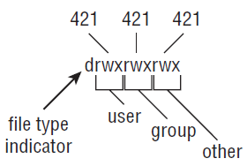

# Files

Everything in Linux is a file. 

## Types of Files

There are five basic types of file in Linux system. 

Use `file` command to show a description of file type. Or use `ls -l` to simply show the file type. 

```shell
$ cd /usr/share/doc/
$ file doc-base/install-docs.html
doc-base/install-docs.html: XML document text
$ file doc-base/copyright
doc-base/copyright: ASCII English text
$ file doc/doc-base/changelog.gz
doc-base/changelog.gz: gzip compressed data, from Unix, max compression
$ file /tmp/new
/tmp/new: directory
```

### Regular Files

Regular files includes data file (text, image, archive, etc) and commands (binary, script). First character of permission information for regular file is `-`. 

```shell
$ ls -l /usr/bin/apt-key
-rwxr-xr-x 1 root root 8067 Dec 12 08:48 /usr/bin/apt-key
```

To create a blank regular file, use `touch` command. 

```shell
$ touch /tmp/newfile.txt # Create a blank file
```

### Directory

Directory itself is a file. First character of permission information for directory file is `d`. 

```shell
$ ls -ld /tmp/new
drwxrwxr-x 2 chris chris 4096 Feb 10 15:40 /tmp/new
# note directory must be executable so that users can use it as current directory
```

To create a directory, use `mkdir` command.

```shell
$ mkdir /tmp/new		   # Create "new" directory in /tmp
$ mkdir -p /tmp/a/b/c/new 	# Create parent directories too if not existed already
$ mkdir -m 700 /tmp/new2 	# Create new2 with drwx——— permissions
```

### Links

Links can be used to access the same file from multiple locations, without making copies. 

- Symbolic link: a shortcut to another **file at specific path**. The shortcut and the target file are in fact quite independent, as with own set of permission and ownership, and changing one will not impact the other. First character of permission information for directory file is `l`. 
- Hard link: nearly copies of the same physical file with same inode. Changing one will change all others, and deleting one will not completely remove the file. Hard link works only on regular files. 

To create a link, use `ln` command.

```shell
$ touch myfile
# $ ln <original file> <link>
$ ln myfile myfile-hardlink
$ ln -s myfile myfile-symlink
$ ls -li myfile*
4460742 -rw-rw-r-- 2 chris chris 0 Feb 10 18:01 myfile
4460742 -rw-rw-r-- 2 chris chris 0 Feb 10 18:01 myfile-hardlink
4460748 lrwxrwxrwx 1 chris chris 6 Feb 10 18:02 myfile-symlink -> myfile
```

### Device Files

Computer hardware is represented by device files, which is also called *device drivers*. 

- Block device: storage media. First character of permission information for directory file is `b`. 
- Character device: serial ports and terminal device. First character of permission information for directory file is `c`. 

```shell
$ ls -l /dev/tty0 /dev/sda1 
brw-rw---- 1 root disk 8, 1 Feb 3 17:24 /dev/sda1
crw--w---- 1 root tty 4, 0 Feb 3 17:24 /dev/tty0
```

Note each device file is associated with a major number (indicating the type of device) and minor number (indicating the instance number of the device). Device files are created at boot time or by `udev`, rarely manually. 

### Named Pipes and Sockets

Pipe command `|` is used to send information from one process to another. One can provide a presence in file system for such operations. 

- Named pipes: for local inter-process communication. First character of permission information for directory file is `p`. 
- Socket: for network communication. First character of permission information for directory file is `s`. 

```shell
$ ls -l /tmp/.TV-chris/tvtimefifo-local /tmp/.X11-unix/X0
prw------- 1 chris chris 0 Sep 26 2007 /tmp/.TV-chris/tvtimefifo-local
srwxrwxrwx 1 root root 0 Sep 4 01:30 /tmp/.X11-unix/X0
```

To create a named pipe, use `mkfifo` command. 

## Permissions

Permission information of a file is shown as a 10 character string. 



### Change Permission

To change file permissions, use `chmod` command. 

```shell
$ chmod 0777 directory # grant all permission
$ chmod 0644 file # normal permission
$ chmod u+x file # grant execute permission to user
$ chmod go-rw file # remove read/write permission for group and other
$ chmod a+x file # grant execute permission to all
# recursively change permission everything rooted at specified directory
$ sudo chmod -R 700 /tmp/test
```

The first 0 is a placeholder for commands, indicating one of the following: 

- set-UID program (4): runs with the assigned user permissions, instead of user that launched the command. 
- set-GID program (2): runs with the assigned group permissions instead of group that launched the command. 
- sticky program (1): the directory can only be removed or renamed by owner or root. However users can change the content of files in it. It changes the last permission bit from `x` to `t`. 

### Change Ownership

When a user creates a file, he becomes owner of the file and his primary group is assigned to the file. To change ownership and assigned group, use `chown` and `chgrp` command as `root`. 

```shell
$ chown chris test/ 			# Change owner to chris
$ chgrp market test/ 			# Change group to market
$ chown chris:market test/ 	 	 # Change owner to chris and group to market
$ chown -R chris test/ 			# Change all files below test/ to owner chris
```

## Listing Filesystem

`ls -laFh --color=always` 

- `-l` long list
- `-a` show hidden
- `-F` add a file type indicator
- `-h` human readable 

## Traversing Filesystem

There are a few concepts about file system paths: 

- Absolute path: path from `/`. 
- Relative path: path from current working directory. 


- `.` current directory
- `..` parent directory
- `~` home directory
- `-` previous directory

Basic command used for traversing the filesystem is `cd` and `pwd`. 

### Deal with Links

There are two special options available to `cd` and `pwd` when working with links.

- `-P` access link in the context of permanent location (link target)
- `-L` access link in the context of linked location (link itself)

```shell
$ cd $HOME
$ ln -s /tmp tmp-link
$ ls -l tmp-link
lrwxrwxrwx 1 chris chris 13 Mar 24 12:41 tmp-link -> /tmp
$ cd tmp-link/
$ pwd
/home/chris/tmp-link
$ pwd -P
/tmp
$ pwd -L
/home/chris/tmp-link
$ cd -L ..
$ pwd
/home/chris
$ cd tmp-link
$ cd -P ..
$ pwd
/
```

### Directory Stack

`Bash` can remember previous working directories by putting then into a stack. 

- `pushd <path>`: push path to top of stack
- `pupd`: pop the stack top
- `dirs -v`: show stack
- `pushd ~0`: move the last directory in stack to top
- `pushd ~2`: move the third directory from bottom to top

To use the stack, push all working directories into the stack. Remember to **push one additional directory to stack top** since the top will always be overwritten. Then use `cd ~` to change working directories. 

## Copying Files

`mv` rename a file or move the files into different directory (rename to new path).

```shell
$ mv a b c test/
$ mv d test/dd 
```

`cp` copies a file into a different name or **same name in another directory**. 

- `-i` prompt for overwritten
- `-l` create hard link
- `-a` copy files ownership and permission
- `-R` recursive copy

```shell
$ cp a b c test/	# copy multiple files to directory test/
$ cp d test/dd		# copy a file d into new name test/dd
```

`dd` copies data in terms of byte stream

```shell
# input file /dev/zero is a special ile generates null characters
# output file is ./mynullfile
# count is number of blocks
# bs is block size (512 byte by default)
$ dd if=/dev/zero of=mynullfile count=10 bs=2
10+0 records in
10+0 records out
20 bytes (20 B) copied, 0.000173996 s, 115 kB/s
# use octet dump to check the copied fle
$ od -v -t x1 mynullfile
```

## Searching Files

`whereis` searches binary, configurations, man pages for a command. 

`which` searches command in your `PATH`. 

`locate` command **searches files by name**. It searches a file database instead of filesystem, created by `updatedb`.

`find` command searches the file system, but can **search attributes other than name and it supports regular expression**. 

```shell
# use glob pattern on filename
$ find <path> -name "*.jpg" -print
# regular expression, note it matches full path 
# thus path before filename needs to be included in the pattern
$ find <path> -regex ".*/[a-f0-9\-]\{36\}\.jpg"
# file accessed in the less than 2 minutes
$ find <path> -amin -2 -print
# file hasn't been changed for 60 days (changed greater than 60 days)
$ find <path> -ctime +60 
# find by directory type
$ find <path> -type d
# find by permission
$ find /sbin/ -perm 755
# find by size, sort result, and save into file
$ find / -xdev -size +10M -print | xargs ls -lS > /tmp/bigfiles.txt
# find by owner
$ find /var -user chris -print | xargs ls -l
# use ! to negate search criterion
$ find /sbin/ -type f ! -group root -print | xargs ls -l
# search term in files inside current directory
$ find . -name '*.md' | xargs grep -c "merge"
```

